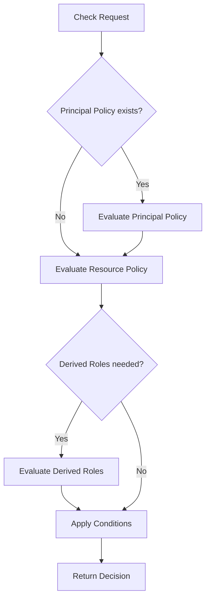

## What are Policies?

Policies are the heart of Cerbos - they define **who** can do **what** on **which resources**. Written in YAML, policies provide a declarative way to express complex authorization logic that evolves with your application.

Cerbos policies are:
- **Version-controlled**: Store them in Git alongside your application code
- **Testable**: Write test suites to verify policy behavior
- **Composable**: Import and reuse policy definitions across your system
- **Dynamic**: Use conditions and expressions for context-aware decisions

## Policy Types

Cerbos provides several policy types that work together:

<CardGroup cols={2}>
  <Card title="Resource Policies" icon="file-shield" href="/policies/resource-policies">
    Define access rules for specific resource types (e.g., documents, projects, users)
  </Card>
  
  <Card title="Derived Roles" icon="users-gear" href="/policies/derived-roles">
    Dynamically assign roles based on contextual data at request time
  </Card>
  
  <Card title="Principal Policies" icon="user-lock" href="/policies/principal-policies">
    Override permissions for specific users or principals
  </Card>
  
  <Card title="Conditions" icon="brackets-curly" href="/policies/conditions">
    Express complex authorization logic using CEL expressions
  </Card>
</CardGroup>

## Policy Structure

Every Cerbos policy follows this basic structure:

```yaml
---
apiVersion: api.cerbos.dev/v1
# Optional: Human-readable description
description: |
  Describes what this policy does

# Optional: Import constants and variables
variables:
  pending_status: '"PENDING_APPROVAL"'
  
# Policy definition (resourcePolicy, derivedRoles, or principalPolicy)
resourcePolicy:
  resource: leave_request
  version: "default"
  rules:
    - actions: ["view", "create"]
      effect: EFFECT_ALLOW
      roles: ["employee"]
```

### Key Components

<AccordionGroup>
  <Accordion title="apiVersion">
    Always set to `api.cerbos.dev/v1`. This specifies the policy schema version.
  </Accordion>
  
  <Accordion title="description (optional)">
    Human-readable text explaining the policy's purpose. Useful for documentation but not evaluated by Cerbos.
  </Accordion>
  
  <Accordion title="variables (optional)">
    Define reusable expressions at the top level. Can be local definitions or imports from export policies.
  </Accordion>
  
  <Accordion title="Policy Body">
    The main policy definition - either `resourcePolicy`, `derivedRoles`, `principalPolicy`, `exportConstants`, or `exportVariables`.
  </Accordion>
</AccordionGroup>

## How Policies Work Together

Cerbos evaluates policies in a specific order to determine access:



### Evaluation Order

1. **Principal Policies** (if defined) - Specific overrides for individual users
2. **Resource Policies** - General rules for the resource type
3. **Derived Roles** (if referenced) - Dynamic role assignment based on context
4. **Conditions** - Fine-grained attribute-based rules

<Note>
  Principal policies take precedence over resource policies. An explicit DENY in a principal policy will override an ALLOW in a resource policy.
</Note>

## Effects: ALLOW vs DENY

Every policy rule must specify an effect:

- **`EFFECT_ALLOW`**: Grants permission for the action
- **`EFFECT_DENY`**: Explicitly denies permission (takes precedence)

```yaml
rules:
  # Allow admins to do everything
  - actions: ["*"]
    effect: EFFECT_ALLOW
    roles: ["admin"]
  
  # Explicitly deny deletion of archived resources
  - actions: ["delete"]
    effect: EFFECT_DENY
    condition:
      match:
        expr: request.resource.attr.archived == true
```

<Warning>
  DENY always wins. If any rule evaluates to DENY, the request is denied even if other rules would allow it.
</Warning>

## Scoping Policies

Policies can be scoped to apply only in specific contexts:

```yaml
resourcePolicy:
  resource: document
  version: "default"
  scope: "acme.corp"  # Only applies to resources in the acme.corp scope
  rules:
    # ...
```

Scopes enable:
- **Multi-tenancy**: Different rules per tenant/organization
- **Environment-specific policies**: Dev, staging, prod variations
- **Hierarchical rules**: Scope inheritance with `acme.corp.engineering`

Learn more in the [Server Configuration](/configuration/server) documentation.

## Schema Validation

Resource policies can reference JSON schemas to validate request data:

```yaml
resourcePolicy:
  resource: leave_request
  version: "default"
  schemas:
    principalSchema:
      ref: cerbos:///principal.json
    resourceSchema:
      ref: cerbos:///resources/leave_request.json
  rules:
    # ...
```

Schemas help catch errors early and provide IDE autocompletion.

## Policy Organization

Organize your policies using a clear directory structure:

```
policies/
├── derived_roles/
│   ├── common_roles.yaml
│   └── admin_roles.yaml
├── resource_policies/
│   ├── document.yaml
│   ├── project.yaml
│   └── leave_request.yaml
├── principal_policies/
│   └── ceo_overrides.yaml
└── exports/
    ├── constants.yaml
    └── variables.yaml
```

<Tip>
  Use descriptive file names that match your resource or role names for easier navigation.
</Tip>

## Best Practices

<Steps>
  <Step title="Start with Resource Policies">
    Define the general access rules for each resource type first. These form the foundation of your authorization model.
  </Step>
  
  <Step title="Extract Common Patterns">
    If you're repeating the same conditions, create derived roles or export variables to make policies DRY.
  </Step>
  
  <Step title="Use Principal Policies Sparingly">
    Principal policies are powerful but can make debugging harder. Use them only for necessary overrides.
  </Step>
  
  <Step title="Test Everything">
    Write comprehensive test suites for all policies. See [Policy Testing](/policies/testing) for details.
  </Step>
  
  <Step title="Version Your Policies">
    Use policy versions to manage changes over time. Old clients can continue using older policy versions.
  </Step>
</Steps>

## Quick Examples

<CodeGroup>
```yaml Simple Access Control
---
apiVersion: api.cerbos.dev/v1
resourcePolicy:
  resource: document
  version: "default"
  rules:
    - actions: ["view", "create"]
      effect: EFFECT_ALLOW
      roles: ["user"]
    
    - actions: ["*"]
      effect: EFFECT_ALLOW
      roles: ["admin"]
```

```yaml Attribute-Based Rules
---
apiVersion: api.cerbos.dev/v1
resourcePolicy:
  resource: document
  version: "default"
  rules:
    # Users can edit their own documents
    - actions: ["edit", "delete"]
      effect: EFFECT_ALLOW
      roles: ["user"]
      condition:
        match:
          expr: request.resource.attr.owner == request.principal.id
```

```yaml With Derived Roles
---
apiVersion: api.cerbos.dev/v1
resourcePolicy:
  resource: document
  version: "default"
  importDerivedRoles:
    - common_roles
  rules:
    # Owners have full access
    - actions: ["*"]
      effect: EFFECT_ALLOW
      derivedRoles: ["owner"]
```
</CodeGroup>

## Next Steps

<CardGroup cols={2}>
  <Card title="Resource Policies" icon="file-shield" href="/policies/resource-policies">
    Learn how to define access rules for your resources
  </Card>
  
  <Card title="Derived Roles" icon="users-gear" href="/policies/derived-roles">
    Create dynamic roles based on request context
  </Card>
  
  <Card title="Conditions" icon="code" href="/policies/conditions">
    Write powerful expressions for fine-grained control
  </Card>
  
  <Card title="Testing" icon="flask" href="/policies/testing">
    Test your policies with cerbos compile
  </Card>
</CardGroup>

## FAQ

<AccordionGroup>
  <Accordion title="What's the difference between roles and derivedRoles?">
    **Roles** are static roles assigned to the principal (e.g., from your identity provider). **Derived roles** are dynamically computed based on the request context - for example, making someone an "owner" if they created the resource.
  </Accordion>
  
  <Accordion title="When should I use a principal policy vs a resource policy?">
    Use **resource policies** for general rules that apply to all users. Use **principal policies** only when you need to override the general rules for specific individuals (e.g., temporarily granting the CEO access to everything).
  </Accordion>
  
  <Accordion title="Can I have multiple rules with the same actions?">
    Yes. Cerbos evaluates all matching rules. If any rule results in DENY, the request is denied. Otherwise, if at least one rule results in ALLOW, the request is allowed.
  </Accordion>
  
  <Accordion title="How do I share conditions across multiple policies?">
    Use **export variables** to define reusable expressions, then import them in your resource or principal policies. See [Conditions](/policies/conditions) for examples.
  </Accordion>
  
  <Accordion title="Do policies cascade or inherit?">
    Policies don't inherit from each other by default, but **scoped policies** do cascade. A policy with scope `acme.corp.engineering` will inherit rules from `acme.corp` and the root policy. You can control this with `scopePermissions`.
  </Accordion>
</AccordionGroup>