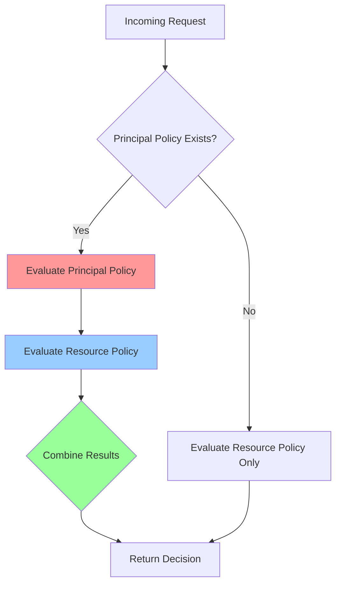

## Overview

Principal policies allow you to define access rules for **specific individuals or service accounts**. They take precedence over resource policies, enabling you to grant or deny permissions for particular users without modifying general resource rules.

Use principal policies to:
- Grant temporary elevated access (e.g., CEO can access everything)
- Implement user-specific overrides (e.g., suspend a user's access)
- Create service account permissions (e.g., backup service can read all data)
- Handle exceptions to general rules

<Warning>
  Principal policies should be used sparingly. They can make your authorization logic harder to understand and debug. Most access control should be handled with resource policies and derived roles.
</Warning>

## Basic Structure

```yaml
---
apiVersion: api.cerbos.dev/v1
principalPolicy:
  principal: "alice"          # Username or principal ID
  version: "default"          # Policy version
  rules:                      # List of resource-action rules
    - resource: document
      actions:
        - action: "*"
          effect: EFFECT_ALLOW
```

### Required Fields

<ParamField path="principal" type="string" required>
  The principal identifier (user ID, service account name, etc.). Must match the `id` field in CheckResources requests.
</ParamField>

<ParamField path="version" type="string" required>
  Policy version identifier. Use `"default"` for the primary version.
</ParamField>

<ParamField path="rules" type="array" required>
  List of rules specifying what this principal can do on various resources.
</ParamField>

## Rule Structure

Principal policy rules differ from resource policy rules:

```yaml
rules:
  - resource: document        # Resource kind
    actions:                  # List of action-specific rules
      - name: "edit-rule"     # Optional rule name
        action: "edit"        # Specific action
        effect: EFFECT_ALLOW  # ALLOW or DENY
        condition:            # Optional condition
          match:
            expr: request.resource.attr.department == "engineering"
```

<ParamField path="resource" type="string" required>
  The resource kind this rule applies to (e.g., `document`, `project`).
</ParamField>

<ParamField path="actions" type="array" required>
  List of action rules. Each action rule specifies permissions for one action.
</ParamField>

### Action Rule Fields

<ParamField path="action" type="string" required>
  The action name. Use `"*"` as a wildcard for all actions.
</ParamField>

<ParamField path="effect" type="string" required>
  Either `EFFECT_ALLOW` or `EFFECT_DENY`.
</ParamField>

<ParamField path="name" type="string">
  Optional identifier for debugging and audit logs.
</ParamField>

<ParamField path="condition" type="object">
  Optional condition that must evaluate to true. See [Conditions](/policies/conditions).
</ParamField>

## Complete Example

```yaml
---
apiVersion: api.cerbos.dev/v1
description: |
  Special permissions for CEO

variables:
  is_dev_record: request.resource.attr.dev_record == true
  is_public: request.resource.attr.public == true

principalPolicy:
  principal: ceo@example.com
  version: "default"
  
  # Optional: Import constants/variables
  constants:
    local:
      sensitive_threshold: 1000000
  
  rules:
    # Full access to financial records
    - resource: financial_record
      actions:
        - action: "*"
          effect: EFFECT_ALLOW
    
    # Read-only access to HR records
    - resource: hr_record
      actions:
        - name: view-hr
          action: "view"
          effect: EFFECT_ALLOW
        
        - name: deny-hr-edit
          action: "edit"
          effect: EFFECT_DENY
    
    # Conditional access to documents
    - resource: document
      actions:
        - action: "view"
          effect: EFFECT_ALLOW
          condition:
            match:
              any:
                of:
                  - expr: V.is_public
                  - expr: request.resource.attr.owner == request.principal.id
        
        - action: "delete"
          effect: EFFECT_ALLOW
          condition:
            match:
              expr: request.resource.attr.value < C.sensitive_threshold
```

## How Principal Policies Work

When a request is evaluated:

1. **Check for principal policy**: If one exists for the requesting principal, evaluate it first
2. **Evaluate resource policy**: Always evaluate the resource policy
3. **Combine results**: Principal policy decisions take precedence



### Precedence Rules

<Steps>
  <Step title="DENY Always Wins">
    If either policy says DENY, the result is DENY.
  </Step>
  
  <Step title="Principal Policy ALLOW Wins">
    If the principal policy says ALLOW, the request is allowed even if the resource policy denies it.
  </Step>
  
  <Step title="Resource Policy as Fallback">
    If the principal policy doesn't have a rule for the action, fall back to the resource policy.
  </Step>
</Steps>

## Use Cases

<AccordionGroup>
  <Accordion title="Temporary Elevated Access">
    Grant a user temporary admin access:
    
    ```yaml
    principalPolicy:
      principal: alice@example.com
      version: "default"
      rules:
        - resource: "*"  # All resources
          actions:
            - action: "*"  # All actions
              effect: EFFECT_ALLOW
              condition:
                match:
                  expr: |-
                    now() < timestamp("2024-12-31T23:59:59Z")
    ```
  </Accordion>
  
  <Accordion title="Suspended User">
    Block a user from all actions:
    
    ```yaml
    principalPolicy:
      principal: suspended_user@example.com
      version: "default"
      rules:
        - resource: "*"
          actions:
            - action: "*"
              effect: EFFECT_DENY
    ```
  </Accordion>
  
  <Accordion title="Service Account Permissions">
    Grant a backup service read-only access:
    
    ```yaml
    principalPolicy:
      principal: backup-service
      version: "default"
      rules:
        - resource: database
          actions:
            - action: "read"
              effect: EFFECT_ALLOW
        
        - resource: storage
          actions:
            - action: "read"
              effect: EFFECT_ALLOW
    ```
  </Accordion>
  
  <Accordion title="Department-Specific Override">
    Allow a manager to access only their department's data:
    
    ```yaml
    principalPolicy:
      principal: manager@example.com
      version: "default"
      rules:
        - resource: employee_record
          actions:
            - action: "view"
              effect: EFFECT_ALLOW
              condition:
                match:
                  expr: request.resource.attr.department == "engineering"
            
            - action: "edit"
              effect: EFFECT_DENY  # Can't edit even in their department
    ```
  </Accordion>
</AccordionGroup>

## Variables and Constants

Principal policies support the same variables and constants as resource policies:

```yaml
principalPolicy:
  principal: alice
  version: "default"
  
  constants:
    local:
      max_value: 10000
    import:
      - global_constants
  
  variables:
    local:
      is_owned: request.resource.attr.owner == request.principal.id
      is_recent: |-
        timestamp(request.resource.attr.created_at).timeSince() < duration("24h")
    import:
      - common_vars
  
  rules:
    - resource: document
      actions:
        - action: "delete"
          effect: EFFECT_ALLOW
          condition:
            match:
              all:
                of:
                  - expr: V.is_owned
                  - expr: V.is_recent
```

## Scoped Principal Policies

Like resource policies, principal policies support scoping:

```yaml
# Base policy: principal_policies/alice.yaml
principalPolicy:
  principal: alice
  version: "default"
  rules:
    - resource: document
      actions:
        - action: "view"
          effect: EFFECT_ALLOW
```

```yaml
# Scoped policy: principal_policies/alice.acme.yaml
principalPolicy:
  principal: alice
  version: "default"
  scope: "acme"  # Only applies when scope=acme
  rules:
    - resource: document
      actions:
        - action: "*"  # More permissive in acme scope
          effect: EFFECT_ALLOW
```

Specify scope in requests:

```json
{
  "principal": {
    "id": "alice",
    "roles": ["user"],
    "scope": "acme"
  }
}
```

### Scope Permissions

Control inheritance from parent scopes:

```yaml
principalPolicy:
  principal: alice
  version: "default"
  scope: "acme.corp.engineering"
  scopePermissions: SCOPE_PERMISSIONS_OVERRIDE_PARENT  # Default
  rules:
    # These rules replace parent scope rules
```

Options:
- `SCOPE_PERMISSIONS_OVERRIDE_PARENT` - Replace parent scope rules (default)
- `SCOPE_PERMISSIONS_MERGE_PARENT` - Combine with parent scope rules

## Action Wildcards

Actions support wildcard matching:

```yaml
rules:
  - resource: document
    actions:
      # Match all actions
      - action: "*"
        effect: EFFECT_ALLOW
      
      # Match view:public, view:private, etc.
      - action: "view:*"
        effect: EFFECT_ALLOW
```

## Output Expressions

Principal policy actions can emit output:

```yaml
rules:
  - resource: document
    actions:
      - action: "view"
        effect: EFFECT_ALLOW
        output:
          when:
            ruleActivated: |-
              {
                "principal": request.principal.id,
                "action": "view",
                "resource": request.resource.id,
                "timestamp": now()
              }
            conditionNotMet: |-
              {
                "message": "Access denied by condition"
              }
```

Outputs are included in API responses for audit logging or UX customization.

## Multiple Versions

Maintain multiple versions of principal policies:

```yaml
# principal_policies/alice_v1.yaml
principalPolicy:
  principal: alice
  version: "v1"
  rules:
    - resource: document
      actions:
        - action: "view"
          effect: EFFECT_ALLOW
```

```yaml
# principal_policies/alice_v2.yaml
principalPolicy:
  principal: alice
  version: "v2"
  rules:
    - resource: document
      actions:
        - action: "*"  # More permissive in v2
          effect: EFFECT_ALLOW
```

Specify version in requests:

```json
{
  "principal": {
    "id": "alice",
    "roles": ["user"],
    "policyVersion": "v2"
  }
}
```

## Best Practices

<CardGroup cols={2}>
  <Card title="Use Sparingly" icon="triangle-exclamation">
    Principal policies make debugging harder. Prefer resource policies with derived roles.
  </Card>
  
  <Card title="Document Why" icon="file-lines">
    Always add a description explaining why the override is needed.
  </Card>
  
  <Card title="Set Expiration" icon="clock">
    For temporary access, use conditions with time-based checks.
  </Card>
  
  <Card title="Audit Regularly" icon="magnifying-glass">
    Review principal policies periodically to remove obsolete overrides.
  </Card>
</CardGroup>

<Tip>
  Consider using resource policies with derived roles for most scenarios. Reserve principal policies for true exceptions.
</Tip>

## Testing Principal Policies

```yaml
# tests/alice_test.yaml
name: AlicePrincipalPolicyTest
description: Tests for Alice's special permissions

principals:
  alice:
    id: alice
    roles: ["user"]
  
  bob:
    id: bob
    roles: ["user"]

resources:
  sensitive_doc:
    kind: document
    id: doc1
    attr:
      sensitivity: high
      owner: bob

tests:
  - name: Alice can access sensitive docs
    input:
      principals: [alice]
      resources: [sensitive_doc]
      actions: [view]
    expected:
      - principal: alice
        resource: sensitive_doc
        actions:
          view: EFFECT_ALLOW  # Via principal policy
  
  - name: Bob cannot access sensitive docs
    input:
      principals: [bob]
      resources: [sensitive_doc]
      actions: [view]
    expected:
      - principal: bob
        resource: sensitive_doc
        actions:
          view: EFFECT_DENY  # Via resource policy
```

## Common Patterns

<AccordionGroup>
  <Accordion title="Read-Only Service Account">
    ```yaml
    principalPolicy:
      principal: monitoring-service
      version: "default"
      rules:
        - resource: "*"
          actions:
            - action: "read"
              effect: EFFECT_ALLOW
            - action: "list"
              effect: EFFECT_ALLOW
            - action: "view"
              effect: EFFECT_ALLOW
    ```
  </Accordion>
  
  <Accordion title="Emergency Admin Access">
    ```yaml
    principalPolicy:
      principal: emergency-admin
      version: "default"
      rules:
        - resource: "*"
          actions:
            - action: "*"
              effect: EFFECT_ALLOW
              condition:
                match:
                  expr: |-
                    request.aux_data.jwt.emergency_mode == true
    ```
  </Accordion>
  
  <Accordion title="Blocked User">
    ```yaml
    principalPolicy:
      principal: blocked-user
      version: "default"
      rules:
        - resource: "*"
          actions:
            - action: "*"
              effect: EFFECT_DENY
              # Allow only reading profile
        - resource: user_profile
          actions:
            - action: "view"
              effect: EFFECT_ALLOW
              condition:
                match:
                  expr: request.resource.id == request.principal.id
    ```
  </Accordion>
</AccordionGroup>

## Troubleshooting

<AccordionGroup>
  <Accordion title="Principal policy not being applied">
    Check that:
    - The `principal` field matches the `principal.id` in your requests exactly
    - The policy version matches (or is "default")
    - The policy file is in the correct location and loaded by Cerbos
    
    Enable debug logging to see which policies are evaluated:
    ```yaml
    server:
      logLevel: debug
    ```
  </Accordion>
  
  <Accordion title="Unexpected DENY results">
    Remember:
    - DENY in principal policy overrides ALLOW in resource policy
    - DENY in resource policy overrides ALLOW in principal policy
    - If neither policy has a rule for the action, default is DENY
    
    Check both policies to see where the DENY comes from.
  </Accordion>
  
  <Accordion title="Condition not matching">
    Verify:
    - Attribute paths match your request data structure
    - Variable/constant references use correct prefix (V., C.)
    - CEL expression syntax is valid
    
    Test conditions with `cerbos compile` to catch errors early.
  </Accordion>
</AccordionGroup>

## When to Use Principal Policies

<Tabs>
  <Tab title="Use Principal Policies">
    - Temporary admin/elevated access
    - User suspension or account blocking
    - Service account permissions
    - Individual exceptions to general rules
    - Emergency access overrides
  </Tab>
  
  <Tab title="Use Resource Policies Instead">
    - General access control for resource types
    - Role-based permissions
    - Ownership-based access (use derived roles)
    - Department/team-based access (use derived roles)
    - Most attribute-based rules
  </Tab>
</Tabs>

<Note>
  If you find yourself creating many principal policies with similar rules, consider refactoring to use resource policies with derived roles instead.
</Note>

## Real-World Example

Here's a complete example for a compliance officer:

```yaml
---
apiVersion: api.cerbos.dev/v1
description: |
  Special permissions for compliance officer.
  Provides read-only access to sensitive data for audit purposes.

variables:
  is_audit_request: request.aux_data.purpose == "audit"
  within_business_hours: |-
    now().getHours() >= 9 && now().getHours() < 17

principalPolicy:
  principal: compliance-officer@example.com
  version: "default"
  
  constants:
    local:
      max_records_per_query: 100
  
  rules:
    # Read access to financial records during business hours
    - resource: financial_record
      actions:
        - name: audit-view
          action: "view"
          effect: EFFECT_ALLOW
          condition:
            match:
              all:
                of:
                  - expr: V.is_audit_request
                  - expr: V.within_business_hours
          output:
            when:
              ruleActivated: |-
                {
                  "audit_log": {
                    "officer": request.principal.id,
                    "resource": request.resource.id,
                    "timestamp": now(),
                    "purpose": request.aux_data.purpose
                  }
                }
        
        - name: deny-edit
          action: "edit"
          effect: EFFECT_DENY  # Read-only access
        
        - name: deny-delete
          action: "delete"
          effect: EFFECT_DENY
    
    # Read access to employee records
    - resource: employee_record
      actions:
        - action: "view"
          effect: EFFECT_ALLOW
          condition:
            match:
              expr: V.is_audit_request
        
        - action: "export"
          effect: EFFECT_DENY  # Cannot export bulk data
    
    # No access to system admin functions
    - resource: system_config
      actions:
        - action: "*"
          effect: EFFECT_DENY
```

## Next Steps

<CardGroup cols={3}>
  <Card title="Resource Policies" icon="file-shield" href="/policies/resource-policies">
    Learn about general resource rules
  </Card>
  
  <Card title="Derived Roles" icon="users-gear" href="/policies/derived-roles">
    Alternative to principal policies for many scenarios
  </Card>
  
  <Card title="Testing" icon="flask" href="/policies/testing">
    Test principal policy precedence
  </Card>
</CardGroup>